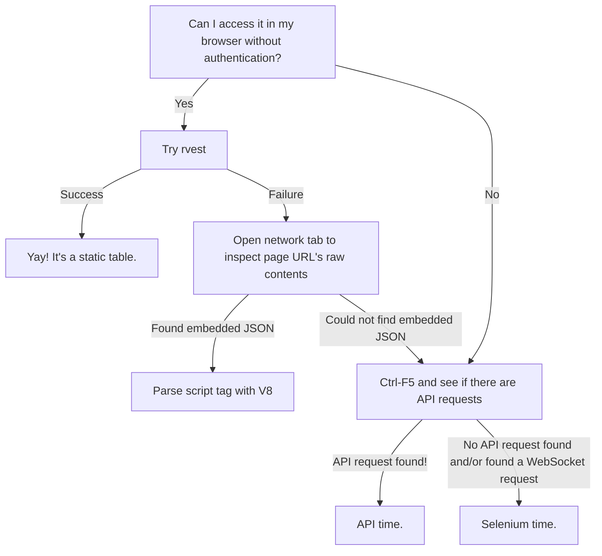

## Scraping with R

A flowchart on getting data you want. 

```mermaid
flowchart TD

A[Can I access it in my browser without authentication?]

A-->|Yes| B[Try rvest]

B-->|Success| C[Yay! It's a static table.]

B-->|Failure| D[Open network tab to inspect page URL's raw contents]

A-->|No| F

D-->|Found embedded JSON| E[Parse script tag with V8]

D-->|Could not find embedded JSON| F[Ctrl-F5 and see if there are API requests]

F-->|API request found!| G[API time.]

F-->|No API request found and/or found a WebSocket request| H[Selenium time.]

```

