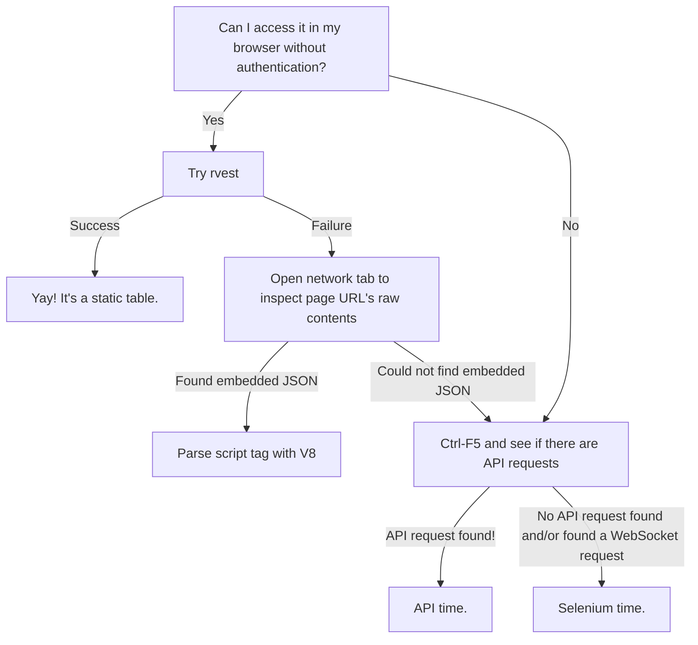

## Scraping with R

A flowchart on getting data you want. 



## Preface: Scraping ethics
{insert discussion of ethics}

{via James Densmore: https://towardsdatascience.com/ethics-in-web-scraping-b96b18136f01}

> The Ethical Scraper
> 
> I, the web scraper will live by the following principles:
> 
> - If you have a public API that provides the data I’m looking for, I’ll use it and avoid scraping all together.
> - I will always provide a User Agent string that makes my intentions clear and provides a way for you to contact me with questions or concerns.
> - I will request data at a reasonable rate. I will strive to never be confused for a DDoS attack.
> - I will only save the data I absolutely need from your page. If all I need it OpenGraph meta-data, that’s all I’ll keep.
> - I will respect any content I do keep. I’ll never pass it off as my own.
> - I will look for ways to return value to you. Maybe I can drive some (real) traffic to your site or credit you in an article or post.
> - I will respond in a timely fashion to your outreach and work with you towards a resolution.
> - I will scrape for the purpose of creating new value from the data, not to duplicate it.
> 
> The Ethical Site Owner
> 
> I, the site owner will live by the following principles:
> 
> - I will allow ethical scrapers to access my site as long as they are not a burden on my site’s performance.
> - I will respect transparent User Agent strings rather than blocking them and encouraging use of scrapers masked as human visitors.
> - I will reach out to the owner of the scraper (thanks to their ethical User Agent string) before blocking permanently. A temporary block is acceptable in the case of site performance or ethical concerns.
> - I understand that scrapers are a reality of the open web.
> - I will consider public APIs to provide data as an alternative to scrapers.

## Basic rvest

## Embedded JSON with V8

```r
library(jsonlite)
library(V8)
library(rvest)
library(tidyverse)

page_html <- rvest::read_html("http://www4.vestibular.ufjf.br/2021/notaspism1/H.html")

script_tags <- page_html |> 
  html_elements("script") |> 
  html_text2() |> 
  str_subset("testdata") |> 
  str_replace_all("\\r","") |> 
  str_replace_all(".+ var (testdata .*)","\\1")

js <- V8::v8()

js$eval(script_tags)

testdata <- js$get("testdata") 

data_test <- testdata$data |> 
  unnest(modulosPISM)
 ```

## APIs

https://github.com/tanho63/office_hours/blob/main/20210719-scraping/scraping-track.R

## Selenium

