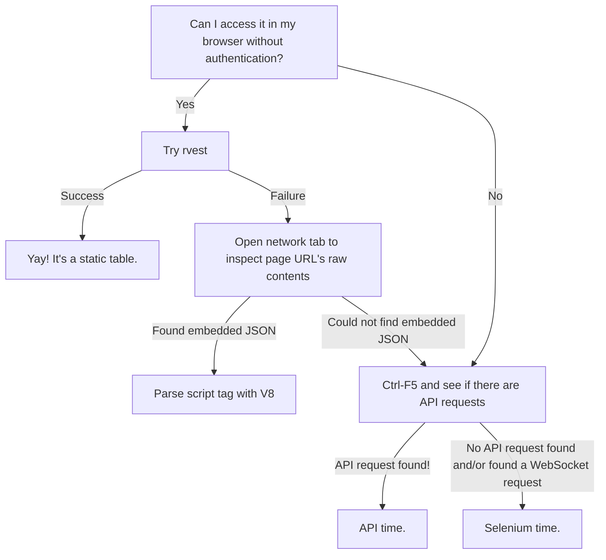

## Scraping with R

A flowchart on getting data you want. 



## Basic rvest

## Embedded JSON with V8

```r
library(jsonlite)
library(V8)
library(rvest)
library(tidyverse)

page_html <- rvest::read_html("http://www4.vestibular.ufjf.br/2021/notaspism1/H.html")

script_tags <- page_html |> 
  html_elements("script") |> 
  html_text2() |> 
  str_subset("testdata") |> 
  str_replace_all("\\r","") |> 
  str_replace_all(".+ var (testdata .*)","\\1")

js <- V8::v8()

js$eval(script_tags)

testdata <- js$get("testdata") 

data_test <- testdata$data |> 
  unnest(modulosPISM)
 ```

## APIs

## Selenium

