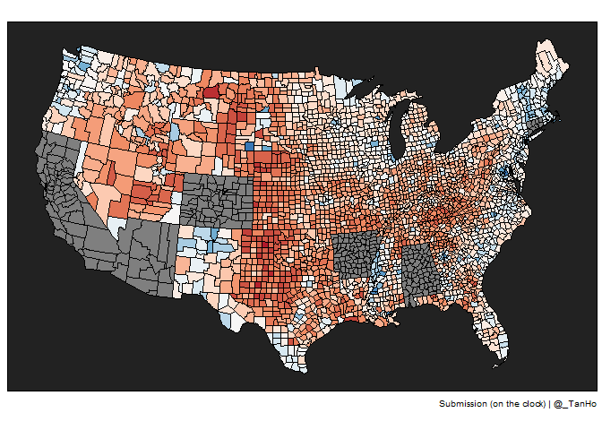
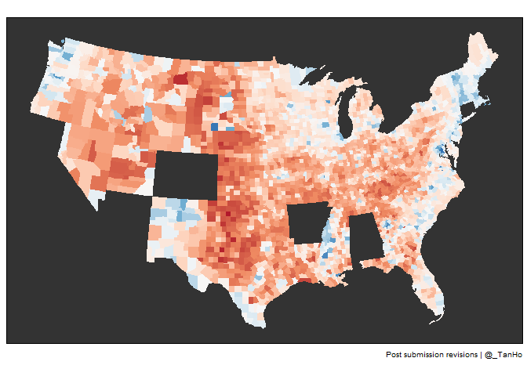

quick viz challenge
================
Tan Ho
2021-07-22

So last night on [Nick Wan’s stream](https://twitch.tv/nickwan_datasci)
I got drawn into a quick “recreate-this-viz” challenge…


goal viz - US map of 2016 election results

[VOD here](https://www.twitch.tv/videos/1095134933), challenge starts
around 2h15m in.

``` r
library(readr)
library(dplyr)
library(ggplot2)
library(stringr)
library(usmap)
```

``` r
county_data <- read_csv("https://raw.githubusercontent.com/magi-1/presidential-elections/main/Data/TAMIDS%20Given/county_level.csv")
```

    ## Rows: 3152 Columns: 10

    ## -- Column specification --------------------------------------------------------
    ## Delimiter: ","
    ## chr (3): state_name, county_fips, county_name
    ## dbl (7): votes_gop, votes_dem, total_votes, diff, per_gop, per_dem, per_poin...

    ## 
    ## i Use `spec()` to retrieve the full column specification for this data.
    ## i Specify the column types or set `show_col_types = FALSE` to quiet this message.

``` r
fips_county <- county_data %>% 
  filter(!state_name %in% c("Alaska", "Hawaii")) %>% 
  filter(!str_starts(county_fips, "0")) %>% 
  transmute(fips = county_fips, value = votes_gop/total_votes)

inclusions <- county_data %>%
  filter(!state_name %in% c("Alaska", "Hawaii")) %>%
  pull(county_fips)

exclusions <- county_data %>% 
  filter(state_name %in% c("Alaska", "Hawaii")) %>% 
  pull(county_fips)

plot_usmap(regions = "county", 
           data = fips_county, 
           include = inclusions,
           values = "value",
           exclude = exclusions,
           labels = FALSE) + 
  scale_fill_distiller(palette = "RdBu") + 
  theme(
    legend.position = "none",
    panel.background = element_rect(fill = "#222222")
  ) + 
  labs(caption = "Submission (on the clock) | @_TanHo")
```

<!-- -->

That’s what I managed to get done while on the clock! This morning I
thought of a few other tweaks to get it closer…

``` r
inclusions_two <- county_data %>% 
  filter(!state_name %in% c("Alaska", "Hawaii"),
         !str_starts(county_fips,"0")
         ) %>% 
  pull(county_fips)

exclusions_two <- county_data %>% 
  filter(state_name %in% c("Alaska", "Hawaii"),
         str_starts(county_fips,"0")
         ) %>% 
  pull(county_fips)

plot_usmap(regions = "county", 
           data = fips_county, 
           include = inclusions_two,
           values = "value",
           exclude = exclusions_two, 
           color = "transparent",
           labels = FALSE) + 
  scale_fill_distiller(palette = "RdBu") + 
  theme(
    legend.position = "none",
    panel.background = element_rect(fill = "#333333")
  ) + 
  labs(caption = "Post submission revisions | @_TanHo")
```

<!-- -->

Kyle’s experience in Tableau definitely showed through, and deservingly
had a better graded plot - but for “half-asleep-at-11pm” +
“never-done-a-single-viz-before” I’m overall pleased by my efforts for a
thirty minute challenge. I now know what the heck a fips code is!

Things I don’t know at this time:

-   how do I get the North America countries background to overlay
    underneath

All in all, I think this’ll be a fun sliced-like challenge for Nick to
run and I might even be interested in competing…
