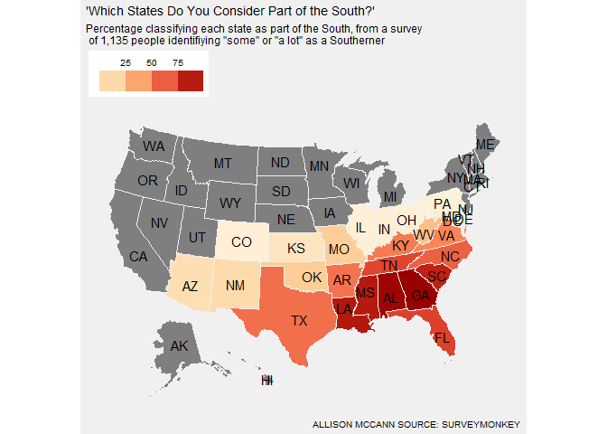

VizBuzz Round One
================

``` r
suppressPackageStartupMessages({
  library(tidyverse)
  library(tantastic)
  library(ggthemes)
  library(usmap)
  # library(hrbrthemes)
  # library(scales)
  # library(patchwork)
  # library(cowplot)
})
```

``` r
south_raw <- read.csv("data.csv")

south <- south_raw |> 
  pivot_longer(c(-RespondentID,-identify_as_southerner),names_to = "state") |> 
  filter(!is.na(RespondentID)) |> 
  group_by(state) |> 
  summarise(value = mean(value, na.rm = TRUE)) |> 
  ungroup() |> 
  mutate(
    state = str_replace(state, "\\.", " "),
    value = value * 100
  ) |> 
  left_join(
    tibble(state = state.name, 
           state_abb = state.abb),
    by = "state"
  ) |> 
  select(state = state_abb, value)

plot_usmap(regions = "states",
           data = south,
           values = "value",
           # include = south$states,
           # exclude = state.abb[!state.abb %in% south$state],
           labels = TRUE,
           color = "#F0F0F0") + 
  theme_map(base_family = "IBM Plex Sans") +
  # annotate(x = "CO",geom = "text",label = "1% of \nrespondents \nconsidered\n Colorado part \nof the South")+
  scale_fill_distiller(palette = "OrRd", 
                       direction = 1,
                       guide = guide_colorsteps(title = "",label.position = c("top"))) + 
  theme(panel.background = element_rect(fill = "#F0F0F0",colour = "#F0F0F0"),
        plot.background = element_rect(fill = "#F0F0F0", colour = "#F0F0F0"),
        axis.text = element_blank(),
        axis.title = element_blank(),
        legend.position = "top",
        plot.title.position = "plot") + 
  labs(title = "'Which States Do You Consider Part of the South?'",
       subtitle = 'Percentage classifying each state as part of the South, from a survey \n of 1,135 people identifiying "some" or "a lot" as a Southerner',
       caption = "ALLISON MCCANN SOURCE: SURVEYMONKEY")
```

<!-- -->
